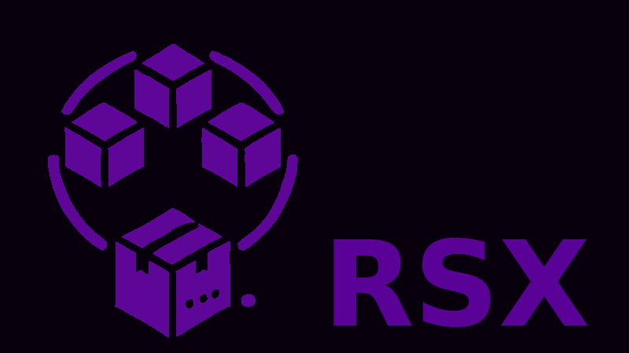

# RSX: Package Risor Scripts into Go Binaries

`rsx` is a tool that packages your [Risor](https://risor.io) scripts into a standalone Go binary, allowing for easy distribution of your applications without dependencies.

> [!NOTE]
> RSX is currently in beta.

## Features

- Package Risor scripts into a single executable
- Built-in Risor modules for additional functionality
  - [Worker pool](https://github.com/rubiojr/risor-libs/blob/main/docs/pool.md)
  - [RSX](https://github.com/rubiojr/risor-libs/blob/main/docs/rsx.md)
- Easy project initialization and management
- Built-in SQLite support with FTS5
- Ability to external Risor native modules:

```risor
import rsx

rsx.load("gh:rubiojr/risor-libs/lib/test", { branch: "main" })
```
- Additional Risor Go modules included:
  - [sched](https://github.com/rubiojr/risor-modules/tree/main/sched/sched.md): Schedule tasks

## Pre-requisites

You need to have Go installed on your system. If you don't have it, you can download it from the [official website](https://golang.org/dl/).

## Installation

Install RSX using Go:

```bash
go install --tags fts5,semver github.com/rubiojr/rsx@latest
```

Ensure that your Go bin directory is in your PATH.

## Quick Start

1. Create a new Risor project:
   ```bash
   rsx new myapp
   cd myapp
   ```

2. Edit the main script (`main.risor`) to add your code:
   ```risor
   import rsx

   rsx.log("Hello from Risor!")
   ```

3. Build the Go binary:
   ```bash
   rsx build
   ```

> [!NOTE]
> rbx runs `go build` under the hood, so you can pass any additional environment variables to it, like `GOOS`, `GOARCH`, etc.

4. Run your application:
   ```bash
   ./myapp
   # Output: Hello from Risor!
   ```

## Project Structure

- `main.risor`: The entry point of your application.
- `lib/`: Directory for additional Risor modules.

## Adding custom Risor modules

Place any additional `.risor` files in the `lib` directory. They will be automatically available at runtime.

## Adding custom Risor Go modules

External Risor Go modules are supported. To add a custom Go module, follow these steps:

Add a `.modules` file in the root of your project with the following format:

```plaintext
github.com/rubiojr/risor-modules/hello
github.com/rubiojr/risor-modules/onemore
```

Where each line is the Go module path used in a Go import statement.

Then, run `rsx build` to build the binary with the custom module.

Risor Go modules are regular Go modules that extend Risor functionality with new built-ins, like https://github.com/rubiojr/risor-modules/hello.

See related official documentation at https://risor.io/docs/contributing_modules.

## The RSX Module

RSX comes with a built-in `rsx` module providing basic functionality. For available functions, refer to [rsx.risor](lib/rsx.risor).

## Development Workflow

During development, you can run your Risor scripts directly:

```bash
# needs main.risor as the main entry point
rsx run
```

Or you can use `eval` also:

```bash
rsx eval main.risor
```

This allows for faster iteration without needing to rebuild the binary.

> [!NOTE]
> Custom native Go modules not built into RSX are not avaible with `rsx run`.
> If you are using a custom module, you will need to build the binary with `rsx build` to test it.

## Projects using RSX

- [Verba](https://github.com/rubiojr/verba-go): API server to store and index Spanish RTVE news transcripts.
- [Firefox history exporter](https://github.com/rubiojr/history-exporter) - Firefox history to JSON exports.

## Contributing

Contributions are welcome! Please feel free to submit a Pull Request.

## Support

For issues, questions, or contributions, please [open an issue](https://github.com/rubiojr/rsx/issues) on GitHub.
